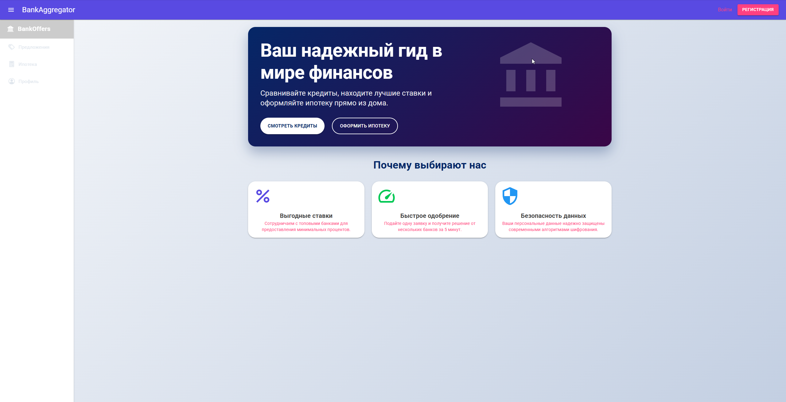
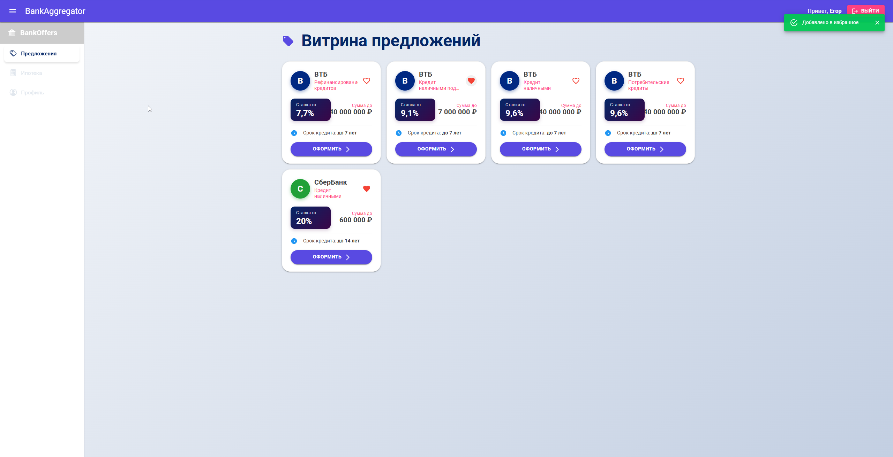
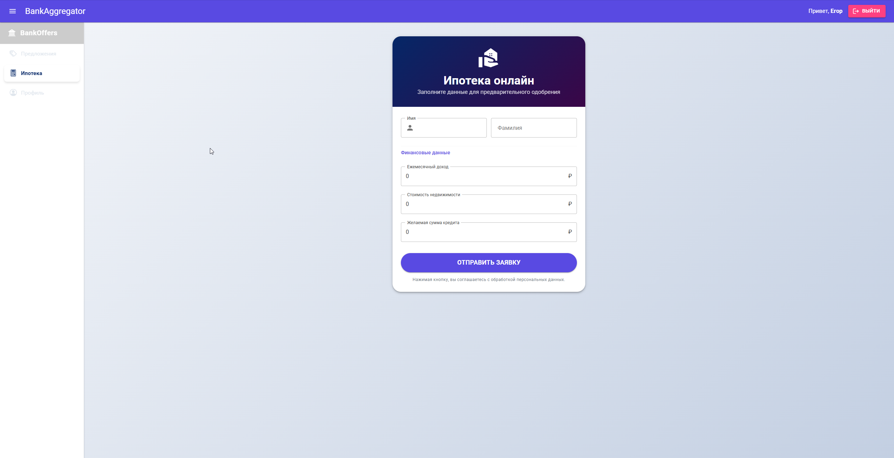
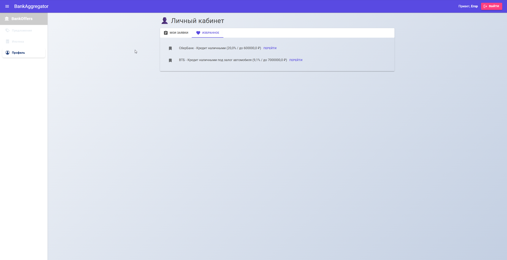
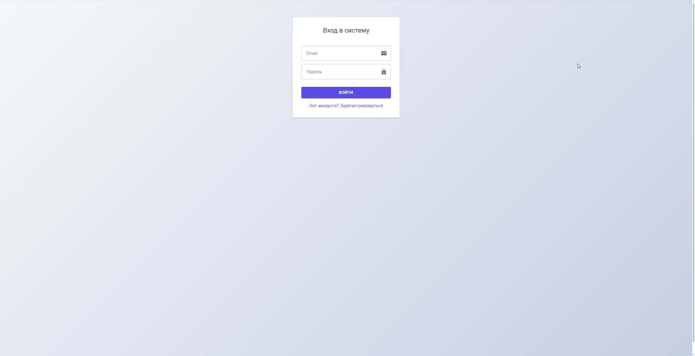
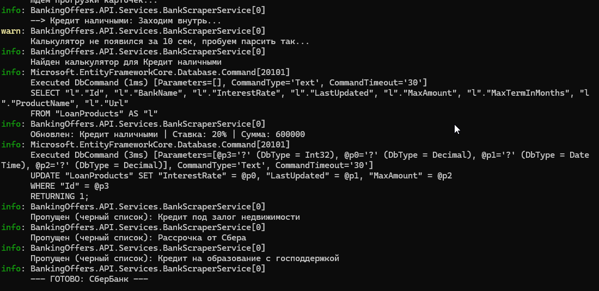

# BankAggregator 🏦

Веб-приложение для агрегации и сравнения банковских кредитных предложений.
Автоматически собирает актуальные данные с сайтов банков через веб-скрапинг
и отображает их в удобном виде для сравнения.

---

## Скриншоты

### Главная страница


### Витрина предложений


### Форма ипотеки


### Личный кабинет


### Вход в систему


### Работа парсера (консоль)


---

## Стек технологий

**Backend**
- ASP.NET Core Web API (.NET 8)
- Entity Framework Core + SQLite (`banking.db`)
- JWT-аутентификация
- Playwright (веб-скрапинг банков)

**Frontend**
- Blazor WebAssembly
- MudBlazor (UI-компоненты)

---

## Структура проекта
BankingOffersSolution/

├── BankingOffers.API/           # Backend — REST API

│   ├── Configuration/           # ScrapingTarget, SelectorPaths

│   ├── Controllers/             # Auth, Favorites, Mortgages, Products

│   ├── DTOs/                    # MortgageDtos, UserDtos

│   ├── Data/                    # ApplicationDbContext

│   ├── Entities/                # User, LoanProduct, MortgageApplication, Favorite

│   ├── Migrations/              # EF Core миграции

│   ├── Models/                  # MortgageApplicationForm

│   └── Services/                # BankScraperService

└── BankingOffers.Frontend/      # Frontend — Blazor WebAssembly

├── Components/              # OfferList

├── Layout/                  # MainLayout, NavMenu, LoginLayout

├── Models/                  # LoanProduct, MortgageApplicationForm, UserDtos

├── Pages/                   # Home, Login, Register, Offers, Profile, MortgageForm

└── Providers/               # CustomAuthStateProvider

---

## Функциональность

- 🔍 **Агрегация предложений** — автоматический сбор кредитных продуктов
  с сайтов ВТБ и Сбербанка через Playwright
- 📊 **Витрина предложений** — карточки с процентной ставкой, суммой и сроком кредита
- ❤️ **Избранное** — сохранение и просмотр понравившихся предложений в личном кабинете
- 🏠 **Ипотека онлайн** — форма подачи заявки с финансовыми данными
- 👤 **Личный кабинет** — история заявок и избранные предложения
- 🔐 **Аутентификация** — регистрация и вход через JWT

---

## Парсируемые банки

| Банк | Продукты |
|------|----------|
| ВТБ | Рефинансирование кредитов, кредит наличными под залог авто, кредит наличными, потребительские кредиты |
| Сбербанк | Кредит наличными |

Парсер автоматически обновляет ставки, суммы и сроки в базе данных при каждом запуске.
Продукты из чёрного списка (рассрочка, образовательные кредиты и т.д.) пропускаются.

---

## API эндпоинты

| Метод | Путь | Описание |
|-------|------|----------|
| POST | `/api/auth/register` | Регистрация |
| POST | `/api/auth/login` | Вход, получение JWT |
| GET | `/api/products` | Список кредитных предложений |
| GET/POST/DELETE | `/api/favorites` | Избранные предложения |
| GET/POST | `/api/mortgages` | Ипотечные заявки |

---

## Запуск проекта

### Требования
- .NET 8 SDK
- Playwright (устанавливается отдельно)

### Backend

```bash
cd BankingOffers.API
dotnet restore
dotnet ef database update
dotnet run
```

### Frontend

```bash
cd BankingOffers.Frontend
dotnet restore
dotnet run
```

### Playwright (первый запуск)

```bash
dotnet tool install --global Microsoft.Playwright.CLI
playwright install
```

---

## База данных

Используется SQLite — файл `banking.db` создаётся автоматически при первом запуске
через EF Core миграции. Парсер обновляет данные напрямую в БД через EF Core.
